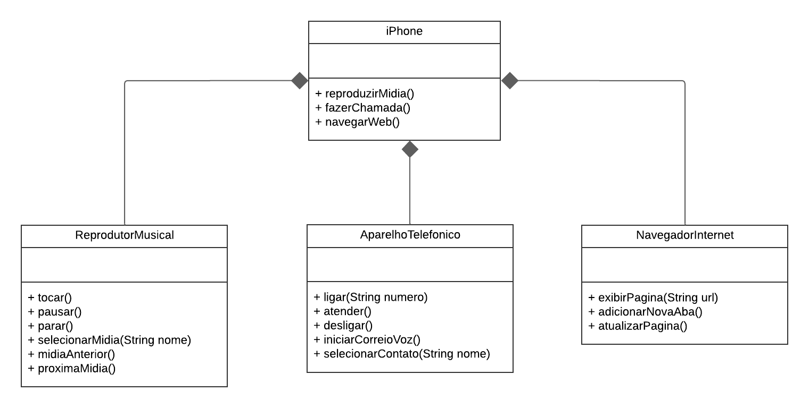

# Projeto: iPhone 2007 - Diagrama de Classe e Implementação em Java

## Descrição

Este projeto foi desenvolvido como parte de um desafio de estudo da plataforma **DIO.me**, onde o objetivo era criar um **Diagrama de Classe** que representasse as funcionalidades do **iPhone de 2007**. As classes foram implementadas em **Java** para simular a integração de várias funcionalidades presentes no iPhone, como **reprodutor de música**, **aparelho telefônico** e **navegador de internet**.

### Funcionalidades:
- Reproduzir música e vídeo (MediaPlayer).
- Fazer chamadas telefônicas (Phone).
- Navegar pela internet (Browser).

## Tecnologias utilizadas

- **Java** (linguagem principal)
- **Interfaces** para abstração dos dispositivos (como o `MediaPlayer`, `Phone`, e `Browser`).
- **Recursos de Orientação a Objetos** como **implementação de interfaces** e **uso de Records** para encapsular funcionalidades.

## Como rodar o projeto

1. Clone o repositório:
2. Para começar, clone o repositório do projeto em sua máquina local. Abra seu terminal (ou Git Bash) e execute o seguinte comando:
   ```bash
   git clone https://github.com/JefersonSatoshi/dio-basico-uml-poo

## Diagrama de Classe

Aqui está o diagrama de classe que representa a estrutura do sistema.

  
